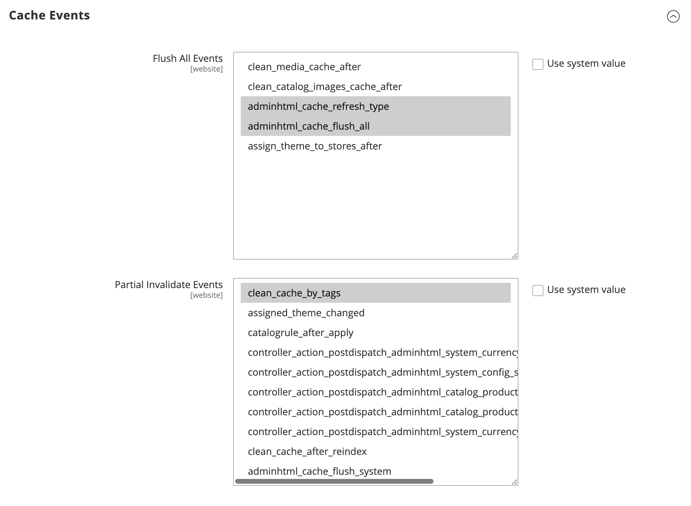
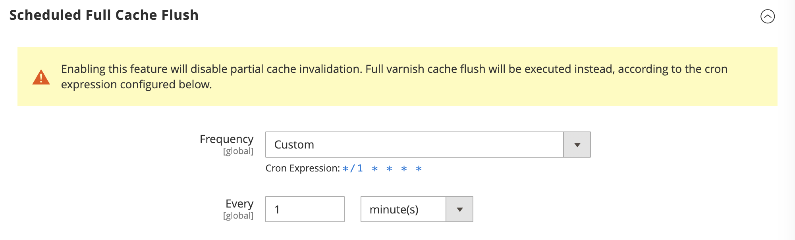

# Webscale Varnish for Magento 2

Webscale Varnish is a Magento 2 extension that connects your store’s full page
cache to the Webscale Control Plane, so your store is cached – and stays in
sync – at the edge.

> **In short:** Magento → Webscale Varnish (this extension) → Webscale Control
> Plane → Varnish at the edge.

- **Supports:** Magento `2.3.x`, `2.4.x`
- **Needs:** Webscale account (API token + Application ID / environment)
- **Docs:** See [Further documentation](#further-documentation)

---

## How it works (high level)

Webscale Varnish does **not** invent its own cache invalidation rules. Instead it
relays Magento’s existing invalidations to the Webscale platform:

**Magento → Webscale Varnish (this extension) → Webscale Control Plane → Varnish**

- Magento generates cache invalidation events based on your store configuration.
- The Webscale Varnish extension receives those events and sends them to Webscale.
- The Webscale Control Plane applies the invalidations to your edge Varnish cache.

Misconfigured or overly aggressive invalidation in Magento will therefore still
result in frequent cache flushes at the edge.

---

## Requirements

- Magento: `2.3.x` or `2.4.x`
- A Webscale account with:
  - API token
  - Application ID / environment configured for your Magento store

---

## Quick start (installation)

Run the following in your Magento root directory.

1. **Add the Webscale repository**

   ```bash
   composer config repositories.webscale-networks-api git https://github.com/webscale-networks/magento-varnish-api.git
   ```

   To avoid CI/CD issues with GitHub, set `"no-api": true` in your `composer.json`:

   ```json
   "repositories": {
     "webscale-networks-api": {
       "type": "git",
       "url": "https://github.com/webscale-networks/magento-varnish-api.git",
       "no-api": true
     }
   }
   ```

2. **Require the extension**

   ```bash
   composer require webscale-networks/magento-varnish-api
   ```

3. **Enable the module and update Magento**

   ```bash
   php bin/magento module:enable Webscale_Varnish
   php bin/magento setup:upgrade
   bin/magento cache:clean
   ```

4. **Log into the Magento Admin**

   After deployment, log into the Magento admin panel to complete configuration.

---

## Configure Webscale Varnish

Once the module is installed, configure it in the Magento admin.

### 1. Configure Webscale credentials

1. In the Magento admin, go to:

   ```text
   Stores > Configuration > Webscale > Webscale Varnish
   ```

2. Under **General Configuration**:
   - Set **Enabled** to **Yes**.
   - Enter your **API token**.
   - Enter your **Application Id** (the Webscale application/environment that
     corresponds to this Magento store).

3. Click **Save Config**.


### 2. Use Varnish for Magento FPC

1. In the Magento admin, go to:

   ```text
   Stores > Configuration > Advanced > System > Full Page Cache
   ```

2. In the **Caching Application** field, select **Varnish Cache**.
3. Save the configuration.


Your store’s full page cache will now be served by Varnish and integrated with
Webscale via this extension.

---

## Optional configuration

These options are available in the **Webscale Varnish** configuration section.

### Debug mode


Enable **Debug** under the **Developer** section to get more detailed logs from the
extension.

- Log file path: `var/log/webscale.log` in your Magento root.
- Use this when troubleshooting cache behavior or connectivity with Webscale.

### Cache events



The **Cache Events** section lists Magento events that trigger Webscale cache
flushes. All events are selected by default.

- Deselect events to **reduce how often the cache is invalidated**.
- Keep only the events that are necessary for your business requirements.

> **Important**
>
> Too many invalidation events can increase load on your origin and APIs.
> Review events carefully on busy or heavily integrated stores.

### Scheduled full cache flush



Webscale Varnish supports a scheduled *full* cache flush via cron.

- When **Scheduled Full Cache Flush** is enabled:
  - Partial (per-tag) invalidation is **disabled**.
  - The entire Webscale Varnish cache is flushed on a schedule.

You can choose one of three frequency modes:

- **Hourly**
- **Daily**
- **Custom** (provide a cron expression)

A cron expression helper in the UI shows the generated schedule.

> **Warning**
>
> Full cache flushes are expensive. Use scheduled full flush only when you need a
> predictable reset schedule and have validated the performance impact in a
> staging or non-production environment.

---

## Managing Webscale Varnish cache from Magento


Webscale Varnish cache is automatically flushed in response to Magento’s native
cache events (full cache flush and per-tag invalidation).

To flush *only* the Webscale Varnish cache from the Magento admin:

1. Go to:

   ```text
   System > Tools > Cache Management
   ```

2. In **Additional Cache Management**, click **Flush Webscale Varnish Cache**.

This clears only the Webscale Varnish cache, without flushing all Magento caches.

---

## Related extensions

- [webscale-networks/magento-varnish-split-header](https://github.com/webscale-networks/magento-varnish-split-header)  
  Sub-module that splits the `X-Magento-Tags` header when Varnish is selected as
  a cache solution, to avoid oversized headers.

---

## Further documentation

Platform-wide Webscale and Varnish documentation, configuration guidance, and
troubleshooting guides are available at:

- https://docs.webscale.com/
