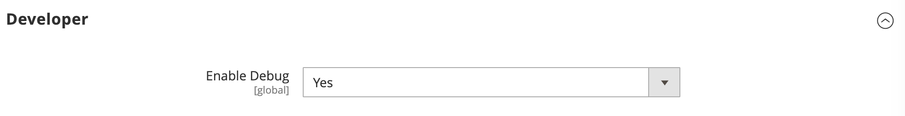

# Webscale VelocityEDGE
Allows to setup and configure VelocityEDGE magento extension.

## Installation
To install extension start with the following in magento root directory to add repository:
```console
composer config repositories.webscale-networks-api git https://github.com/webscale-networks/magento-varnish-api.git
```

To avoid issues with CI/CD and github add `"no-api": true` to the repo settings, so it looks like this:
```console
"webscale-networks-api": {
    "type": "git",
    "url": "https://github.com/webscale-networks/magento-varnish-api.git",
    "no-api": true
}
```

Now require extension itself:
```console
composer require webscale-networks/magento-varnish-api
```

After composer installs the package run next Magento commands:

```console
php bin/magento module:enable Webscale_Varnish
php bin/magento setup:upgrade
bin/magento cache:clean
```

Once completed log in to the Magento admin panel and proceed to configuring the extension.

## Configuration

To enter the credentials open a browser and log in to the Magento admin. Next, navigate to:
```
Stores > Configuration > Webscale > VelocityEDGE
```

Enable the module by switching `Enabled` to `Yes` under `General Configuration` section and enter `API token` and `Application Id`:


Save the configuration. After setting up API token and Application Id navigate to `Stores > Configuration > Advanced > System`, open `Full Page Cache` section and select `Varnish` in `Caching Application` field:


## Optional

### Debug Mode

You can also select `Enable Debug` under `Developer` section - this will result to more detailed server logs:



Log file can be found at `MAGENTO_ROOT/var/log/webscale.log`.

### Cache Events

In this section all the magento observing events listed that is triggering VelocityEDGE cache flush. By default - all selected, but it can be configured by selecting/deselecting items from list: 


### Scheduled Full Cache Flush

> Enabling this feature will disable partial cache invalidation. Full VelocityEDGE cache flush will be executed instead, according to the cron expression configured.


Choose one of the three frequency modes: hourly, daily or custom. Cron expression helper will display configured cron expression to validate.  

## Managing VelocityEDGE Cache

VelocityEDGE cache will be flushed by default with all Magento native cache events, partial by tags or full cache flush.
To flush specifically only VelocityEDGE cache - navigate to `System > Tools > Cache Management` and click `Flush VelocityEDGE Cache` button under `Additional Cache Management` section:


